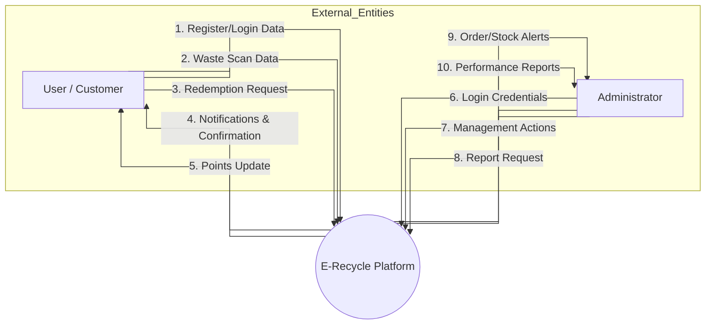
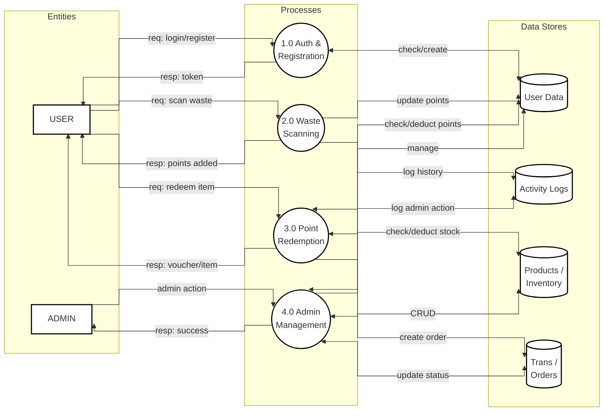
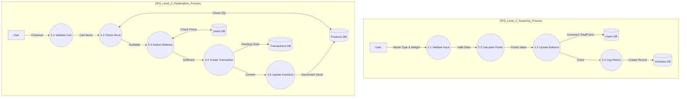

```mermaid
graph LR
    %%{ init: { 'flowchart': { 'curve': 'stepAfter' } } }%%
    %% DFD Level 0 (Context Diagram)
    
    subgraph External_Entities
        direction TB
        User[User / Customer]
        Admin[Administrator]
    end

    System((E-Recycle Platform))

    %% User Flow
    User -->|1. Register/Login Data| System
    User -->|2. Waste Scan Data| System
    User -->|3. Redemption Request| System
    
    System -->|4. Notifications & Confirmation| User
    System -->|5. Points Update| User

    %% Admin Flow
    Admin -->|6. Login Credentials| System
    Admin -->|7. Management Actions| System
    Admin -->|8. Report Request| System
    
    System -->|9. Order/Stock Alerts| Admin
    System -->|10. Performance Reports| Admin
```

```mermaid
graph LR
    %%{ init: { 'flowchart': { 'curve': 'stepAfter', 'nodeSpacing': 50, 'rankSpacing': 100 } } }%%
    
    %% LAYOUT: Left (Entities) -> Center (Processes) -> Right (Data Stores)

    subgraph Entities_Layer [Entities]
        direction TB
        User[USER]
        Admin[ADMIN]
    end

    subgraph Processes_Layer [Processes]
        direction TB
        P1((1.0 Auth &<br/>Registration))
        P2((2.0 Waste<br/>Scanning))
        P3((3.0 Point<br/>Redemption))
        P4((4.0 Admin<br/>Management))
    end

    subgraph Data_Stores_Layer [Data Stores]
        direction TB
        D1[(User Data)]
        D2[(Activity Logs)]
        D3[(Products /<br/>Inventory)]
        D4[(Trans /<br/>Orders)]
    end

    %% --- CONNECTIONS ---

    %% 1.0 Auth Process
    User -->|req: login/register| P1
    P1 -->|resp: token| User
    P1 <-->|check/create| D1

    %% 2.0 Scanning Process
    User -->|req: scan waste| P2
    P2 -->|resp: points added| User
    P2 -->|update points| D1
    P2 -->|log history| D2

    %% 3.0 Redemption Process
    User -->|req: redeem item| P3
    P3 -->|resp: voucher/item| User
    P3 <-->|check/deduct stock| D3
    P3 <-->|check/deduct points| D1
    P3 -->|create order| D4

    %% 4.0 Admin Process
    Admin -->|admin action| P4
    P4 -->|resp: success| Admin
    P4 <-->|CRUD| D3
    P4 <-->|manage| D1
    P4 <-->|update status| D4
    P4 -->|log admin action| D2

    %% Styling to mimic example
    classDef proc fill:#fff,stroke:#000,stroke-width:2px;
    classDef store fill:#fff,stroke:#000,stroke-width:2px,shape:cylinder;
    classDef entity fill:#fff,stroke:#000,stroke-width:2px,shape:rect;

    class P1,P2,P3,P4 proc;
    class D1,D2,D3,D4 store;
    class User,Admin entity;
```

```mermaid
graph TD
    %% DFD Level 2 (Detailed Processes)
    subgraph DFD_Level_2_Scanning_Process
    
    %% Detailed Sub-processes for 2.0 Waste Scanning
    User[User]
    
    P2_1((2.1 Validate Input))
    P2_2((2.2 Calculate Points))
    P2_3((2.3 Update Balance))
    P2_4((2.4 Log History))

    DB_Users[(Users DB)]
    DB_Activities[(Activities DB)]

    User -->|Waste Type & Weight| P2_1
    P2_1 -->|Valid Data| P2_2
    P2_2 -->|Points Value| P2_3
    P2_3 -->|Increment TotalPoints| DB_Users
    P2_3 -->|Grant| P2_4
    P2_4 -->|Create Record| DB_Activities
    end

    subgraph DFD_Level_2_Redemption_Process
    %% Detailed Sub-processes for 3.0 Redemption
    User2[User]
    
    P3_1((3.1 Validate Cart))
    P3_2((3.2 Check Stock))
    P3_3((3.3 Deduct Balance))
    P3_4((3.4 Create Transaction))
    P3_5((3.5 Update Inventory))

    DB_Users2[(Users DB)]
    DB_Products2[(Products DB)]
    DB_Trans2[(Transactions DB)]

    User2 -->|Checkout| P3_1
    P3_1 -->|Cart Items| P3_2
    P3_2 <-->|Check Qty| DB_Products2
    P3_2 -->|Available| P3_3
    P3_3 <-->|Check Points| DB_Users2
    P3_3 -->|Sufficient| P3_4
    P3_4 -->|Pending Order| DB_Trans2
    P3_4 -->|Commit| P3_5
    P3_5 -->|Decrement Stock| DB_Products2
    end
```
