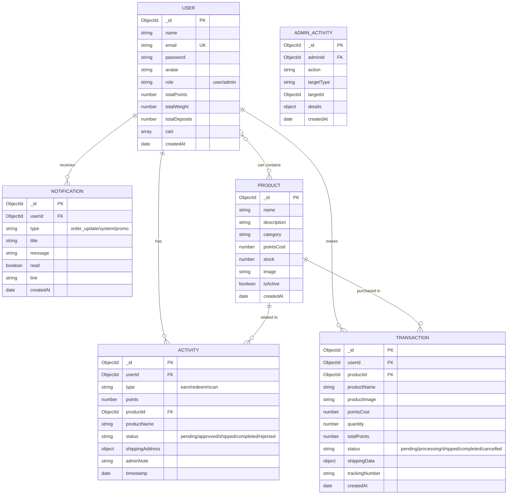

# RecycleVibes - System Diagrams

Dokumen ini berisi diagram sistem untuk aplikasi RecycleVibes dalam format Mermaid.

---

## 1. Entity Relationship Diagram (ERD)

---

## 2. Data Flow Diagram (DFD)

### DFD Level 0 - Context Diagram

```mermaid
flowchart LR
    subgraph External["External Entities"]
        U[("👤 User")]
        A[("🛡️ Admin")]
    end

    subgraph System["RecycleVibes System"]
        S[["🌱 RecycleVibes Platform"]]
    end

    U -->|"Scan Barcode"| S
    U -->|"Redeem Points"| S
    U -->|"View Products"| S
    S -->|"Points & Notifications"| U
    S -->|"Products & Receipts"| U

    A -->|"Manage Products"| S
    A -->|"Update Order Status"| S
    S -->|"Reports & Orders"| A
```

### DFD Level 1 - Main Processes

```mermaid
flowchart TB
    subgraph External
        U[("👤 User")]
        A[("🛡️ Admin")]
    end

    subgraph Processes
        P1["1.0<br/>User Authentication"]
        P2["2.0<br/>Barcode Scanning"]
        P3["3.0<br/>Point Management"]
        P4["4.0<br/>Product Redemption"]
        P5["5.0<br/>Order Management"]
        P6["6.0<br/>Notification System"]
    end

    subgraph DataStores
        D1[("D1: Users")]
        D2[("D2: Products")]
        D3[("D3: Activities")]
        D4[("D4: Transactions")]
        D5[("D5: Notifications")]
    end

    U -->|"Login/Register"| P1
    P1 -->|"User Data"| D1

    U -->|"Scan Request"| P2
    P2 -->|"Activity Log"| D3
    P2 -->|"Update Points"| P3

    P3 -->|"Points Update"| D1

    U -->|"Purchase Request"| P4
    P4 -->|"Check Stock"| D2
    P4 -->|"Create Transaction"| D4
    P4 -->|"Log Activity"| D3
    P4 -->|"Deduct Points"| P3

    A -->|"Update Status"| P5
    P5 -->|"Update Order"| D3
    P5 -->|"Trigger Notification"| P6

    P6 -->|"Store Notification"| D5
    D5 -->|"Notifications"| U
```

### DFD Level 2 - Barcode Scanning Process (2.0)

### DFD Level 2 - Product Redemption Process (4.0)

---

## 3. Activity Diagram - User Purchase Flow

---

## 4. Activity Diagram - Admin Order Management

---

## 5. Activity Diagram - Barcode Scanning

---

> **Note:** Diagram ini dibuat dalam format Mermaid dan dapat di-export ke draw.io atau tools diagram lainnya.
